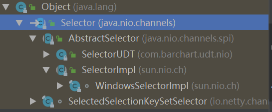
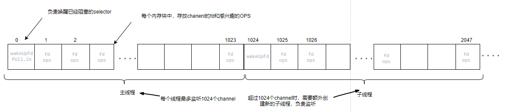

# NIO  

JDK 1.4中的java.nio.*包中引入新的Java I/O库，其目的是提高速度。实际上，“旧”的I/O包已经使用NIO**重新实现过，即使我们不显式的使用NIO编程，也能从中受益。**

- 下面使用NIO复制文件和传统IO复制文件比较一下性能：

```java
import java.io.*;
import java.nio.ByteBuffer;
import java.nio.channels.FileChannel;

public class SimpleFileTransferTest {

    private long transferFile(File source, File des) throws IOException {
        long startTime = System.currentTimeMillis();

        if (!des.exists())
            des.createNewFile();

        BufferedInputStream bis = new BufferedInputStream(new FileInputStream(source));
        BufferedOutputStream bos = new BufferedOutputStream(new FileOutputStream(des));

        //将数据源读到的内容写入目的地--使用数组
        byte[] bytes = new byte[1024 * 1024];
        int len;
        while ((len = bis.read(bytes)) != -1) {
            bos.write(bytes, 0, len);
        }

        long endTime = System.currentTimeMillis();
        return endTime - startTime;
    }

    //使用NIO进行文件拷贝
    private long transferFileWithNIO(File source, File des) throws IOException {
        long startTime = System.currentTimeMillis();

        if (!des.exists())
            des.createNewFile();

        RandomAccessFile read = new RandomAccessFile(source, "rw");
        RandomAccessFile write = new RandomAccessFile(des, "rw");

        FileChannel readChannel = read.getChannel();
        FileChannel writeChannel = write.getChannel();


        ByteBuffer byteBuffer = ByteBuffer.allocate(1024 * 1024);//1M缓冲区

        while (readChannel.read(byteBuffer) > 0) {
            byteBuffer.flip();
            writeChannel.write(byteBuffer);
            byteBuffer.clear();
        }

        writeChannel.close();
        readChannel.close();
        long endTime = System.currentTimeMillis();
        return endTime - startTime;
    }

    public static void main(String[] args) throws IOException {
        SimpleFileTransferTest simpleFileTransferTest = new SimpleFileTransferTest();
        File sourse = new File("F:\\电影\\[电影天堂www.dygod.cn]猜火车-cd1.rmvb");
        File des = new File("X:\\Users\\ozc\\Desktop\\io.avi");
        File nio = new File("X:\\Users\\ozc\\Desktop\\nio.avi");

        long time = simpleFileTransferTest.transferFile(sourse, des);
        System.out.println(time + "：普通字节流时间");

        long timeNio = simpleFileTransferTest.transferFileWithNIO(sourse, nio);
        System.out.println(timeNio + "：NIO时间");
    }
}
```

## NIO与普通IO的主要区别

IO | NIO |
---------------------- | --------------------------|
面向流(Stream Oriented) | 面向缓冲区(Buffer Oriented)|
阻塞IO(Blocking IO)     | 非阻塞IO(Non Blocking IO)  |
(无)                   | 选择器(Selectors)|

## NIO网络通信

### 服务端

```java
public class CommServer implements Runnable  {
    private int port;
    private Selector selector;
    private ServerSocketChannel serverSocketChannel;
    private boolean stop = false;

    public void setPort(int port) {
        this.port = port;
    }

    public void run() {
        try {
            //(1)打开服务端ServerSocket
            serverSocketChannel = ServerSocketChannel.open();
            //(2)打开服务端Selector
            selector = Selector.open();
            //(3)配置ServerSocket为非阻塞状态
            serverSocketChannel.configureBlocking(false);
            //(4)服务端ServerSocket绑定本地端口
            serverSocketChannel.socket().bind(new InetSocketAddress(port));
            //(5)服务端注册监听事件
            serverSocketChannel.register(selector, SelectionKey.OP_ACCEPT);
        } catch (IOException e) {
            e.printStackTrace();
        }

        while (!stop) {
            try {
                //(6)selector循环监听是否有新的事件触发，直到1000ms到达就唤醒，否则阻塞
                selector.select(1000);
                //获取触发事件的selectKeys
                Set<SelectionKey> selectionKeys = selector.selectedKeys();
                Iterator<SelectionKey> iterator = selectionKeys.iterator();
                while (iterator.hasNext()) {
                    SelectionKey selectionKey = iterator.next();
                    //如果客户端和服务端建立连接
                    if(selectionKey.isAcceptable()) {
                        ServerSocketChannel temp = (ServerSocketChannel)selectionKey.channel();
                        //服务端和客户端建立连接后，获取新创建的SocketChannel，进行读和写操作
                        SocketChannel temp1 = temp.accept();
                        temp1.configureBlocking(false);
                        //服务端监听读事件
                        temp1.register(selector, SelectionKey.OP_READ);
                    }
                    //如果有可读事件
                    else if(selectionKey.isReadable()) {
                        SocketChannel temp = (SocketChannel)selectionKey.channel();
                        ByteBuffer byteBuffer = ByteBuffer.allocate(100);
                        //将channel中的byte读入到Buffer中
                        while (temp.read(byteBuffer) > 0) {
                            System.out.println(new String(byteBuffer.array()));
                            byteBuffer.clear();
                        }
                        temp.close();
                    }
                    iterator.remove();
                }
            } catch (IOException e) {
                e.printStackTrace();
            }
        }
    }

    public static void main(String[] args) {

        CommServer commServer = new CommServer();
        commServer.setPort(8888);
        new Thread(commServer).start();
    }
}
```

#### Selector

先看下selector的类图，从这个图上可以看出，在widows操作系统上，selector的最终实现类有WindowsSelectorImpl

- 对于服务端Selector创建

```java
    public static Selector open() throws IOException {
        //SelectorProvider提供了通用的Selector
        return SelectorProvider.provider().openSelector();
    }

        public static SelectorProvider provider() {
        synchronized (lock) {
            if (provider != null)
                return provider;
                //doPrivileged执行内层PrivilegedAction的run方法
            return AccessController.doPrivileged(
                new PrivilegedAction<SelectorProvider>() {
                    public SelectorProvider run() {
                        //从系统属性中获取是否配置了SelectorProvider的类型
                            if (loadProviderFromProperty())
                                return provider;
                            if (loadProviderAsService())
                                return provider;
                            //创建默认的SelectorProvider，和具体的操作系统有关
                            provider = sun.nio.ch.DefaultSelectorProvider.create();
                            return provider;
                        }
                    });
        }
    }

   //和操作系统相关，本机是windows操作系统，创建WindowsSelectorProvider
    public class DefaultSelectorProvider {
    private DefaultSelectorProvider() {
    }

    public static SelectorProvider create() {
        return new WindowsSelectorProvider();
    }
    //创建Selector的实现类WindowsSelectorImpl
    public AbstractSelector openSelector() throws IOException {
        return new WindowsSelectorImpl(this);
    }
}
```
##### SelectorImpl

- 查看下关键的几个成员变量

```java
   //Channel 通道上已经触发的事件的selectKeys
    protected Set<SelectionKey> selectedKeys = new HashSet();
    //Channel注册到selector上的，关心事件的selectKeys
    protected HashSet<SelectionKey> keys = new HashSet();
    private Set<SelectionKey> publicKeys;
    private Set<SelectionKey> publicSelectedKeys;
```

##### WindowsSelectorImpl
- 查看下关键的几个成员变量

```java
    private final int INIT_CAP = 8;
    //selector在监控注册其上的Channel是否有事件触发时，一个线程最多监控1024个通道
    private static final int MAX_SELECTABLE_FDS = 1024;
    //存放注册到该selector上所有channel相关的selectKey，主要作用是对应pollArrayWrapper
    //获取selectKey在pollArrayWrapper的索引
    private SelectionKeyImpl[] channelArray = new SelectionKeyImpl[8];
    //存放注册到该selector上所有channel相关的fd和ops【关注下PollArrayWrapper中的函数putEventOps和putDescriptor】
    //这两个函数一个是存放channel相关的fd，一个是ops
    private PollArrayWrapper pollWrapper = new PollArrayWrapper(8);
    //注册到selector上channel总数
    private int totalChannels = 1;
    //该selector负责监听所有channel的线程总数
    private int threadsCount = 0;
    //存放所有线程
    private final List<WindowsSelectorImpl.SelectThread> threads = new ArrayList();
    //selector创建的自身管道，当selector阻塞时，负责唤醒selector
    private final Pipe wakeupPipe = Pipe.open();
    //唤醒管道fd的读通道
    private final int wakeupSourceFd;
    //唤醒管道fd的写通道
    private final int wakeupSinkFd;
    private Object closeLock = new Object();
    //存储channel的fd与selectKey的对应map，其中包含了updateCount和clearedCount
    private final WindowsSelectorImpl.FdMap fdMap = new WindowsSelectorImpl.FdMap();
    //该selector中负责实际监听的子subselector，此处创建了一个主线程中的子subselector
    private final WindowsSelectorImpl.SubSelector subSelector = new WindowsSelectorImpl.SubSelector();
    private long timeout;
    private final Object interruptLock = new Object();
    private volatile boolean interruptTriggered = false;
    //线程启动锁
    private final WindowsSelectorImpl.StartLock startLock = new WindowsSelectorImpl.StartLock();
    //线程结束锁
    private final WindowsSelectorImpl.FinishLock finishLock = new WindowsSelectorImpl.FinishLock();
    private long updateCount = 0L;
````
通过如下的图，可以更加深刻的理解PollArrayWrapper的存储结构，selector是如何监听多个channel的


- selector负责监听所有channel的SubSelector

```java
private final class SubSelector {
        //每个线程负责监听1024个channel，这个线程在 PollArrayWrapper中
        //从pollArrayIndex开始往后数1024个
        private final int pollArrayIndex;
        //下面三个数组，负责存放selector监听到事件的fd
        private final int[] readFds;
        private final int[] writeFds;
        //监听到的异常fd
        private final int[] exceptFds;

        //创建主线程的subselector，起始位置0
        //三个数组，首位存放监听到事件的fd的总数，其余位置放所有的fd
        private SubSelector() {
            this.readFds = new int[1025];
            this.writeFds = new int[1025];
            this.exceptFds = new int[1025];
            this.pollArrayIndex = 0;
        }

        //创建的子线程负责监听的subselector
        private SubSelector(int var2) {
            this.readFds = new int[1025];
            this.writeFds = new int[1025];
            this.exceptFds = new int[1025];
            this.pollArrayIndex = (var2 + 1) * 1024;
        }

         //主线程的poll动作，如果没有事件，此处在native接口poll0处会阻塞
         //如果有事件，poll0会返回，此时readFDs\writeFds\exceptFds存放了需要的值
        private int poll() throws IOException {
            return this.poll0(WindowsSelectorImpl.this.pollWrapper.pollArrayAddress, Math.min(WindowsSelectorImpl.this.totalChannels, 1024), this.readFds, this.writeFds, this.exceptFds, WindowsSelectorImpl.this.timeout);
        }

        //子线程的poll动作监听
        private int poll(int var1) throws IOException {
            return this.poll0(WindowsSelectorImpl.this.pollWrapper.pollArrayAddress + (long)(this.pollArrayIndex * PollArrayWrapper.SIZE_POLLFD), Math.min(1024, WindowsSelectorImpl.this.totalChannels - (var1 + 1) * 1024), this.readFds, this.writeFds, this.exceptFds, WindowsSelectorImpl.this.timeout);
        }

        private native int poll0(long var1, int var3, int[] var4, int[] var5, int[] var6, long var7);

        //统计有多少channel发生了触发事件
        private int processSelectedKeys(long var1) {
            byte var3 = 0;
            //三个事件对应关系:
            //Net.POLLIN -- OP_ACCEPT(16: ServerSocketChannel)\OP_READ(1: SocketChannel)
            //Net.POLLOUT -- OP_WRITE(4: SocketChannel)
            //NET.POLLCONN -- OP_CONNECT(8: SocketChannel)
            //读事件
            int var4 = var3 + this.processFDSet(var1, this.readFds, Net.POLLIN, false);
            //写事件
            var4 += this.processFDSet(var1, this.writeFds, Net.POLLCONN | Net.POLLOUT, false);
            //异常事件
            var4 += this.processFDSet(var1, this.exceptFds, Net.POLLIN | Net.POLLCONN | Net.POLLOUT, true);
            return var4;
        }

        private int processFDSet(long var1, int[] var3, int var4, boolean var5) {
            int var6 = 0;

            //var3[0]存放的触发事件的总数
            for(int var7 = 1; var7 <= var3[0]; ++var7) {
                int var8 = var3[var7];
                //如果是唤醒事件，那么记录下interruptTriggered标记，不统计计数
                if (var8 == WindowsSelectorImpl.this.wakeupSourceFd) {
                    synchronized(WindowsSelectorImpl.this.interruptLock) {
                        WindowsSelectorImpl.this.interruptTriggered = true;
                    }
                } else {
                    //根据fd获取相对应的selectKey
                    WindowsSelectorImpl.MapEntry var9 = WindowsSelectorImpl.this.fdMap.get(var8);
                    if (var9 != null) {
                        SelectionKeyImpl var10 = var9.ski;
                        if (!var5 || !(var10.channel() instanceof SocketChannelImpl) || !WindowsSelectorImpl.this.discardUrgentData(var8)) {
                            if (WindowsSelectorImpl.this.selectedKeys.contains(var10)) {
                                if (var9.clearedCount != var1) {
                                    if (var10.channel.translateAndSetReadyOps(var4, var10) && var9.updateCount != var1) {
                                        var9.updateCount = var1;
                                        ++var6;
                                    }
                                } else if (var10.channel.translateAndUpdateReadyOps(var4, var10) && var9.updateCount != var1) {
                                    var9.updateCount = var1;
                                    ++var6;
                                }

                                var9.clearedCount = var1;
                            } else {
                                if (var9.clearedCount != var1) {
                                    var10.channel.translateAndSetReadyOps(var4, var10);
                                    if ((var10.nioReadyOps() & var10.nioInterestOps()) != 0) {
                                        WindowsSelectorImpl.this.selectedKeys.add(var10);
                                        var9.updateCount = var1;
                                        ++var6;
                                    }
                                } else {
                                    var10.channel.translateAndUpdateReadyOps(var4, var10);
                                    if ((var10.nioReadyOps() & var10.nioInterestOps()) != 0) {
                                        WindowsSelectorImpl.this.selectedKeys.add(var10);
                                        var9.updateCount = var1;
                                        ++var6;
                                    }
                                }

                                var9.clearedCount = var1;
                            }
                        }
                    }
                }
            }

            return var6;
        }
    }
```

查看下构造函数

```java
    WindowsSelectorImpl(SelectorProvider var1) throws IOException {
        super(var1);
        //唤醒管道fd的读通道
        this.wakeupSourceFd = ((SelChImpl)this.wakeupPipe.source()).getFDVal();
        SinkChannelImpl var2 = (SinkChannelImpl)this.wakeupPipe.sink();
        var2.sc.socket().setTcpNoDelay(true);
        //唤醒管道fd的写通道
        this.wakeupSinkFd = var2.getFDVal();
        //将唤醒通道的fd写入pollWrapper的首位
        this.pollWrapper.addWakeupSocket(this.wakeupSourceFd, 0);
    }
```

- selector上注册channel

```java
    protected void implRegister(SelectionKeyImpl var1) {
        synchronized(this.closeLock) {
            if (this.pollWrapper == null) {
                throw new ClosedSelectorException();
            } else {
                this.growIfNeeded();
                this.channelArray[this.totalChannels] = var1;
                var1.setIndex(this.totalChannels);
                this.fdMap.put(var1);
                this.keys.add(var1);
                this.pollWrapper.addEntry(this.totalChannels, var1);
                ++this.totalChannels;
            }
        }
    }

   //判断polWrapper的长度是否需要增加，每次加倍
    private void growIfNeeded() {
        //totalChannels达到了数组channelArray的最大长度时需要加倍
        if (this.channelArray.length == this.totalChannels) {
            int var1 = this.totalChannels * 2;
            SelectionKeyImpl[] var2 = new SelectionKeyImpl[var1];
            //将channelArray拷贝到新的数组var2
            System.arraycopy(this.channelArray, 1, var2, 1, this.totalChannels - 1);
            this.channelArray = var2;
            //将pollWrapper长度增加到var的长度
            this.pollWrapper.grow(var1);
        }

        //如果totalChannels长度增加到1024时，需要新增thread
        if (this.totalChannels % 1024 == 0) {
            //在1024整数倍的位置上放入wakeupSourceFd,用于唤醒
            this.pollWrapper.addWakeupSocket(this.wakeupSourceFd, this.totalChannels);
            ++this.totalChannels;
            ++this.threadsCount;
        }

    }

    //将pollWrapper长度增加到var的长度
    void grow(int var1) {
        PollArrayWrapper var2 = new PollArrayWrapper(var1);

        //将原先pollWrapper中的fd和eventOps，放入到新的pollArrayWrapper中var2
        for(int var3 = 0; var3 < this.size; ++var3) {
            this.replaceEntry(this, var3, var2, var3);
        }
        //原先的内存释放
        this.pollArray.free();
        this.pollArray = var2.pollArray;
        this.size = var2.size;
        this.pollArrayAddress = this.pollArray.address();
    }
```


## 总结

结合图片更容易理解jdk中NIO的架构


